# Mall Customers Segmentation Analysis

## Overview

This project performs customer segmentation analysis on mall customer data using K-means and hierarchical clustering. These methods are known as unsupervised learning methods, the clusters of customers are formed with no ground truth from the dataset. The clusters are merelly agreggates of similar individuals based on the features used for the model. I explored 2D, 3D, and 4D clustering approaches by increasing the number of features from the dataset that are used in each approach to identify distinct customer groups based on their demographic and behavioral characteristics. Even on such a simple dataset it was possible to dive extremely deeply into demographics and spending habits and taking many interesting conclusions from the results.

## Data

The dataset `Mall_Customers.csv` contains the following features:
- CustomerID 
- Genre (Gender)
- Age
- Annual Income (Thousands of $)
- Spending Score (1-100)

## Analysis Steps

1. Data Preprocessing
2. K-means Clustering
   - 2D K-means Clustering (Annual Income, Spending Score)
   - 3D K-means Clustering (Age, Annual Income, Spending Score)
   - 4D K-means Clustering (Genre, Age, Annual Income, Spending Score)
3. Hierarchical Clustering
   - 2D Hierarchical Clustering (Annual Income, Spending Score)
   - 3D Hierarchical Clustering (Age, Annual Income, Spending Score)
   - 4D Hierarchical Clustering (Genre, Age, Annual Income, Spending Score)
4. Comparison of K-means and Hierarchical Clustering Results

## K-means Clustering Results and Discussion

### 2D K-means Clustering (Annual Income, Spending Score)

The elbow method suggests that the optimal number of clusters for 2D analysis is 5, as the decrease in WCSS (Within-Cluster Sum of Squares) starts to slow down after this point.

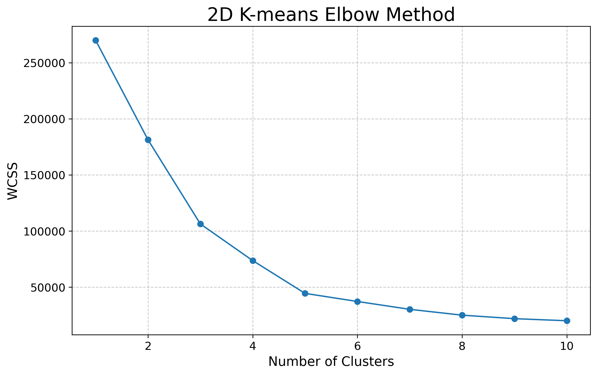

The silhouette analysis confirms that 5 clusters provide a good balance of cluster separation and cohesion. 

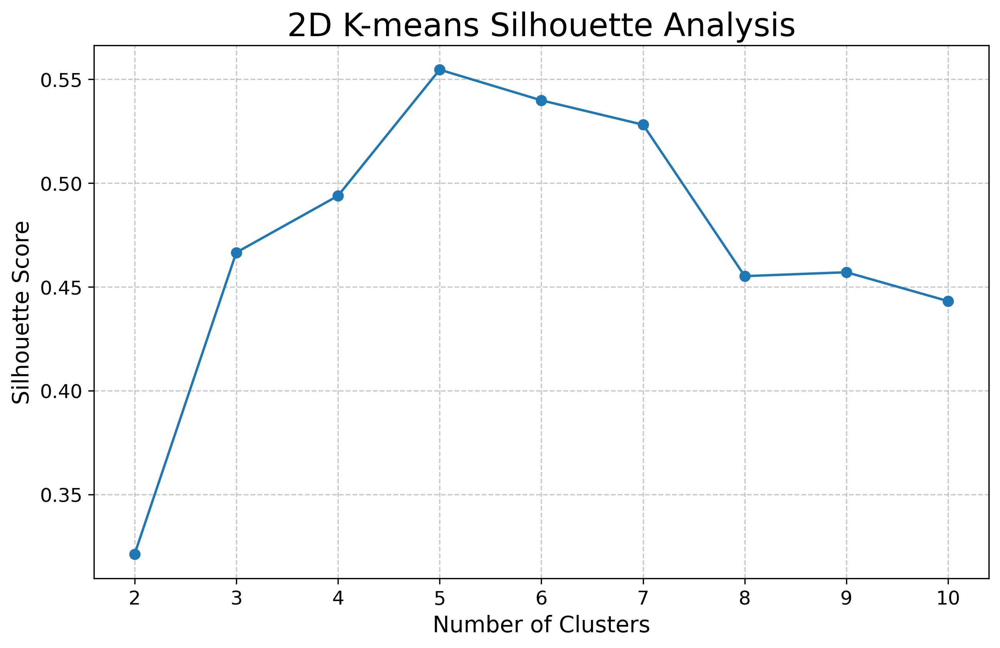

The 2D clustering reveals clear segmentation based on Annual Income and Spending Score:

0. Medium income, medium spending
1. High income, high spending
2. Low income, high spending
3. High income, low spending
4. Low income, low spending

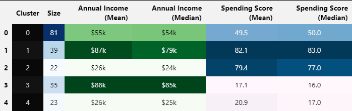

Looking at case 3 (Medium income, medium spending) it would be possible to make an educated guess that there is likely a feature that would split this cluster if it was taken to a higher dimension due to its very tight grouping with apparant split.

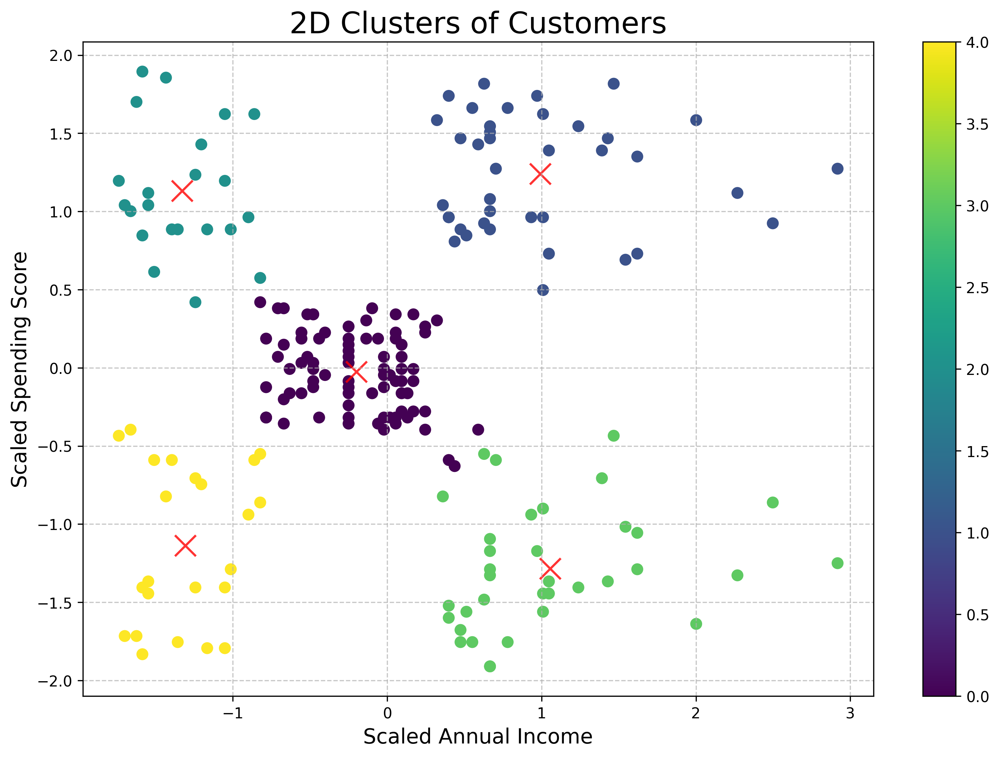

---
### 3D K-means Clustering (Age, Annual Income, Spending Score)
To explore if adding a new feature would help in the cluster formation I included the Age feature to see if the cluster 3 from the previous analysis could indeed be separated.

The elbow method for 3D clustering suggests 5 or 6 as the optimal number of clusters.

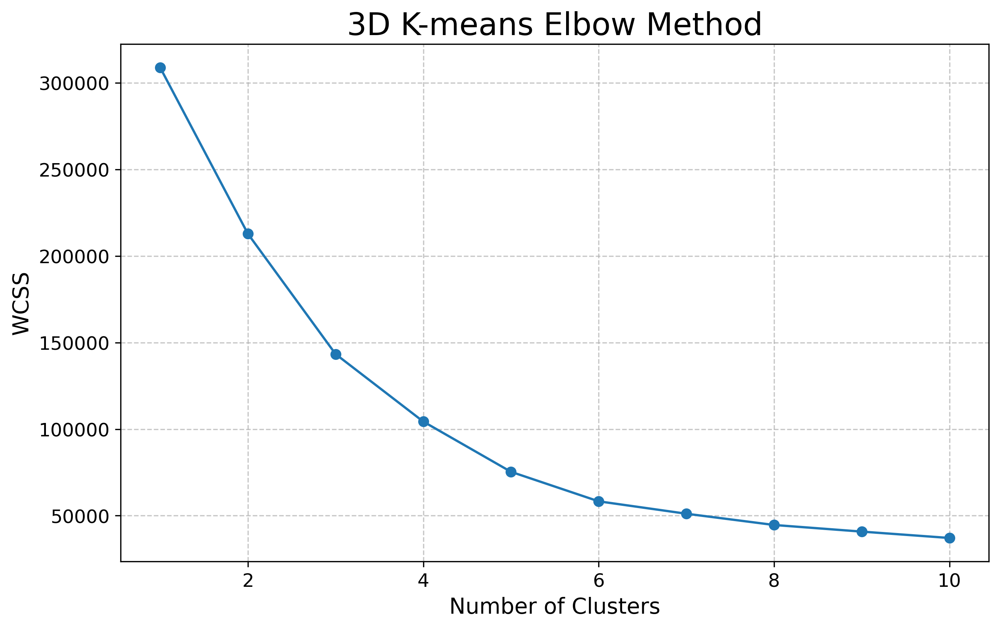

The silhouette scores for 3D clustering are lower than for 2D, indicating that adding the Age dimension makes the clusters less distinct which is not uncommen when increasing dimentions. The silhouette plot indicates a slight benefit to using 6 clusters justifying the choise to use 6 clusters. 

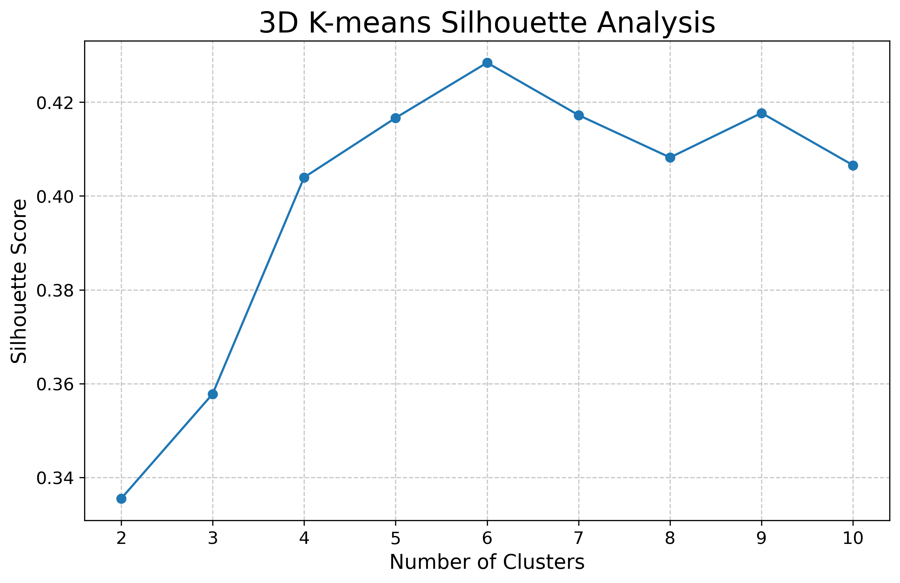

Despite the Silhouette analysis seeming to indicate a loss in separability of the clusters it is possible to see in the table bellow that the cluster of medium income and medium spending split very well into 2 clusters. One with an older population and one with a younger population.

In summary the 3D clustering provides additional insights by incorporating Age:

0. Older, Medium income, medium spending
1. Young, Medium income, medium spending
2. Middle-aged to older, high income, low spending
3. Middle-aged, high income, high spending
4. Young, low income, high spending
5. Older, low income, low spending

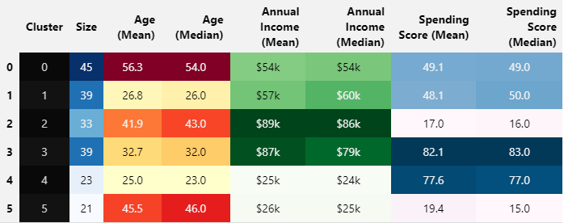

The 3D interactive plot can be visualized in the notebook and gives a much clearer picture of the clusters. This split already allows for a better marketing strategy due to separating groups by ages. Strategies could cater to the particular spending habits of consumers in their age groups and income brackets.

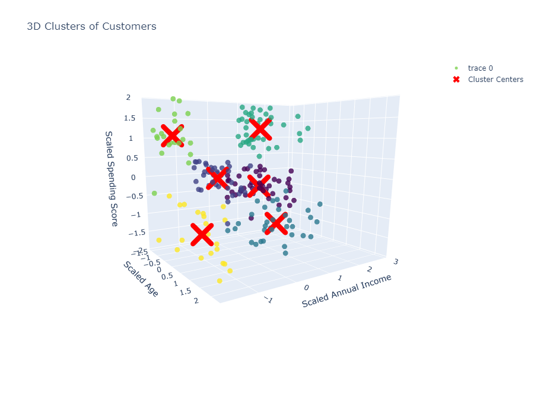

---

### 4D K-means Clustering (Genre, Age, Annual Income, Spending Score)
To try and push the analysis even further and gain even greater insights into the composition of the clusters in terms of consumer characteristics I included the Genre feature to try and split clusters into male and female categories.

The elbow method for 4D clustering continues to support 5 or 6 as the optimal number of clusters. While less clear, not much seems to be gained in terms of separability beyond this point.

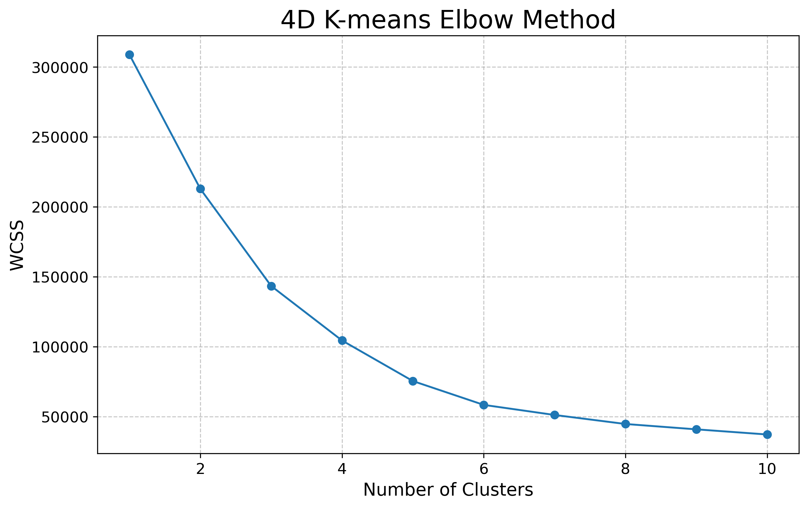

The silhouette scores for 4D clustering are the lowest, suggesting that adding Gender makes the clusters even less distinct. However, it may provide valuable insights for targeted marketing. For consistency I used 6 clusters again despite the uncreased complexity making it very hard to separate clusters in an optimal way. 

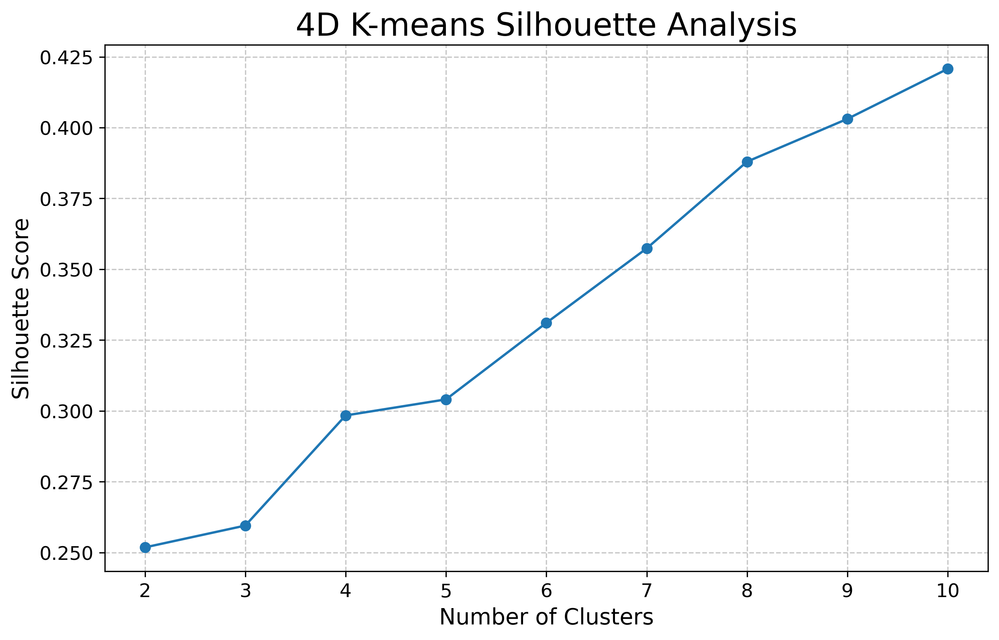

#### 4D Cluster Interpretations

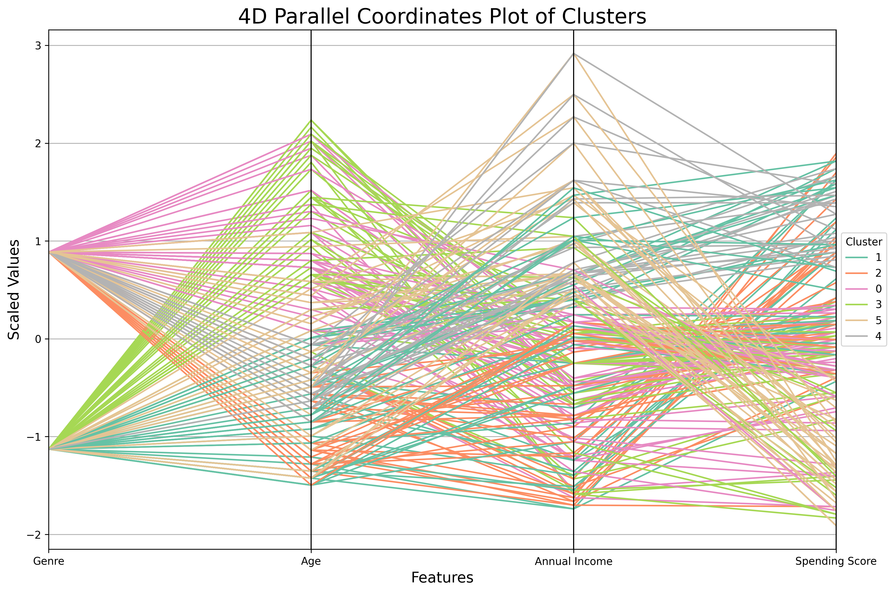

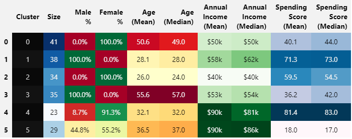

The parallel coordinates plot and the summary table show how the clusters are distributed across all four dimensions. It is possible to observe that:

1. Cluster 0 (41 customers) - Pink: Middle-Aged to Older Female Moderate Spenders
   - Exclusively female (100%)
   - Middle-aged to older group (mean age 50.6, median 49.0)
   - Low to medium income (mean $50k, median $50k)
   - Low to medium spending score (mean 40.1, median 44.0)
   - Interpretation: Represents middle-aged to older females with low to medium income and low to medium spending habits. In this group, income tends to match spending habits.

2. Cluster 1 (38 customers) - Teal: Young to Middle-Aged Male High Spenders
   - Exclusively male (100%)
   - Young to middle-aged group (mean age 28.1, median 28.0)
   - Low to medium income (mean $58k, median $62k)
   - High spending score (mean 71.3, median 73.0)
   - Interpretation: Represents young to middle-aged males with low to medium income and high spending habits. Even low-income males in this group tend to be high spenders.

3. Cluster 2 (34 customers) - Orange: Young to Middle-Aged Female Trend-Setters
   - Exclusively female (100%)
   - Young to middle-aged group (mean age 26.0, median 24.0)
   - Low to medium income (mean $40k, median $40k)
   - Medium-high spending score (mean 59.5, median 54.5)
   - Interpretation: Represents young to middle-aged females with low to medium income and medium-high spending habits. Curiously, it seems that in this group, lower-income females have higher spending habits.

4. Cluster 3 (35 customers) - Green: Middle-Aged to Older Male Conservative Spenders
   - Exclusively male (100%)
   - Middle-aged to older group (mean age 55.6, median 57.0)
   - Low to medium income (mean $53k, median $54k)
   - Low to medium spending score (mean 36.2, median 42.0)
   - Interpretation: Represents middle-aged to older males with low to medium income and low to medium spending habits.

5. Cluster 4 (23 customers) - Grey: Affluent Middle-Aged Female Shoppers
   - Predominantly female (91.3%)
   - Middle-aged group (mean age 32.1, median 32.0)
   - Medium to high income (mean $90k, median $81k)
   - High spending score (mean 81.4, median 83.0)
   - Interpretation: Represents mostly (91.3%) middle-aged females with medium to high income and high spending habits. This is identified as the ideal target for marketing campaigns.

6. Cluster 5 (29 customers) - Gold: Affluent Middle-Aged Conservative Spenders
   - Mixed gender (55.2% female, 44.8% male)
   - Middle-aged group (mean age 36.5, median 37.0)
   - Medium to high income (mean $90k, median $86k)
   - Low spending score (mean 18.0, median 17.0)
   - Interpretation: Represents a mixed-gender middle-aged population with medium to high incomes and low spending habits. This group is identified as another ideal target for marketing, comprising high-income earners of each gender who are not grouping with the high spenders.

### Comparison of 2D, 3D, and 4D Clustering

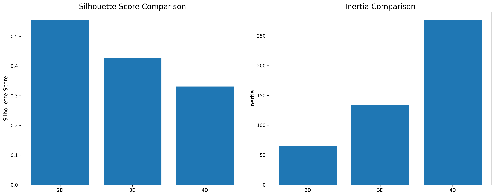

The comparison of silhouette scores and inertia across dimensions reveals:
1. Silhouette scores decrease as dimensions increase, indicating that clusters become less distinct. However the added features do help in creating meaningful interpretations of the clusters and demographics to target with marketing campaigns.
2. Inertia increases with dimensions, which is expected as the data becomes more spread out in higher-dimensional space.

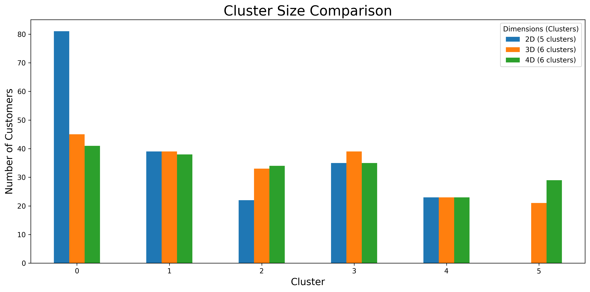

The cluster size comparison shows that:
1. 2D clustering does not split the cluster 0 meaningfully and instead is joining 2 groups together that can be separated by adding age as a variable.
2. 3D and 4D clustering result in more uniform clusters overall.

## Hierarchical Clustering Results and Discussion

### 2D Hierarchical Clustering (Annual Income, Spending Score)

The 2D hierarchical clustering analysis, based on Annual Income and Spending Score, reveals 5 distinct customer segments similar to the K-means results. 

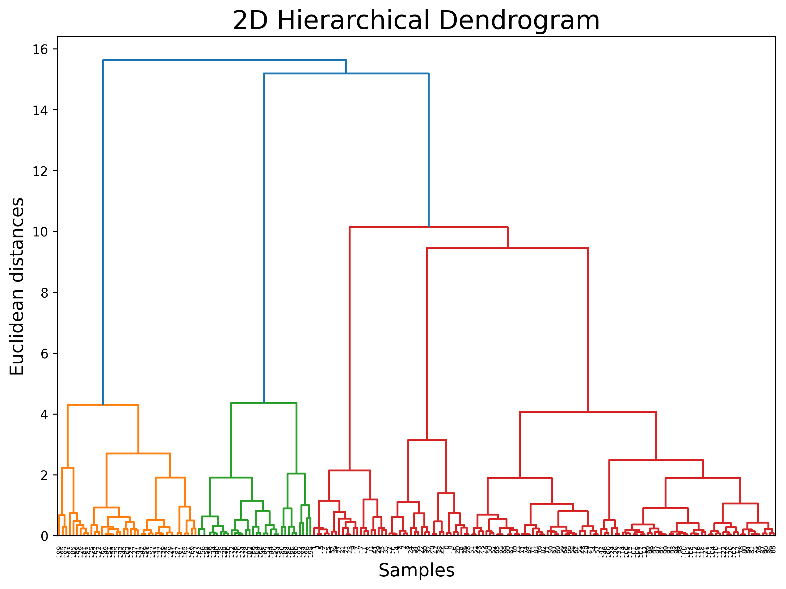

The clusters identified are:

0. High Income, Low Spending
1. High Income, High Spending
2. Medium Income, Medium Spending
3. Low Income, High Spending
4. Low Income, Low Spending

These clusters provide a clear segmentation of customers based on their income and spending habits, offering insights similar to the 2D K-means clustering.

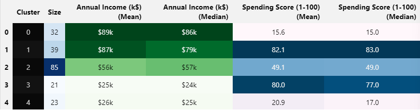

--- 
### 3D Hierarchical Clustering (Age, Annual Income, Spending Score)

Adding Age as a third dimension results in 6 clusters, providing more nuanced insights by incorporating this feature:

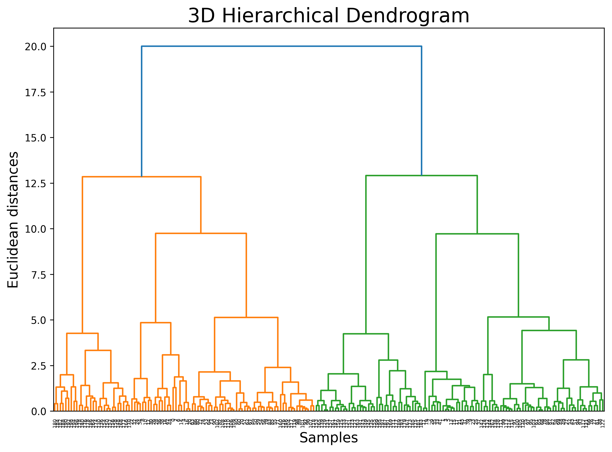

0. Young Adults, Medium Income, Medium Spending
1. Older Adults, Medium Income, Medium Spending
2. Young Adults, High Income, High Spending
3. Middle-Aged, High Income, Low Spending
4. Middle-Aged, Low Income, Low Spending
5. Young Adults, Low Income, High Spending

The 3D clustering reveals distinct segments based on life stages and spending behaviors, such as young high-income spenders and older conservative spenders. Overall very similar results to the K-Means Clustering.

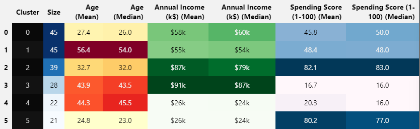

---
### 4D Hierarchical Clustering (Genre, Age, Annual Income, Spending Score)

Adding Gender as the fourth dimension results in 6 clusters with more gender-specific insights:

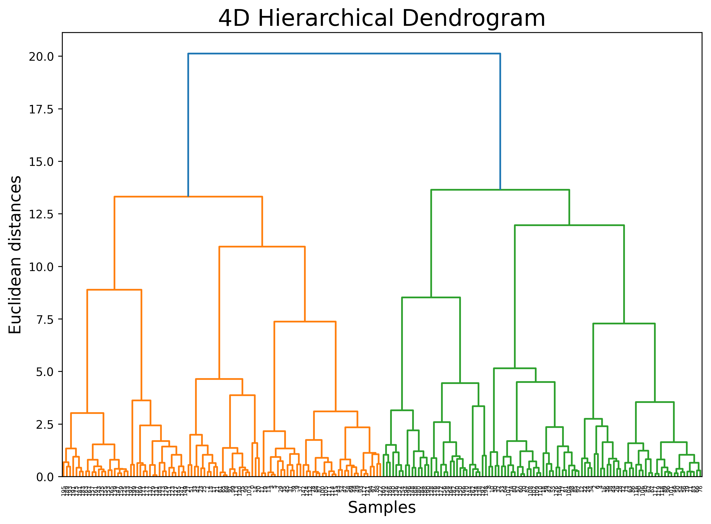

1. Cluster 0 (39 customers): Mixed gender Young to middle aged High Spenders  
   - Mixed gender (46.2% male, 53.8% female)  
   - Young to middle aged group (mean age 32.7, median 32.0)  
   - High income (mean $87k, median $79k)  
   - High spending score (mean 82.1, median 83.0)  
   - Interpretation: Represents a balanced group of young adults with high income and high spending habits.

2. Cluster 1 (38 customers): Exclusively Female Young medium-high Spenders  
   - Exclusively female (100.0%)  
   - Young group (mean age 27.1, median 26.0)  
   - Low income (mean $47k, median $47k)  
   - Medium-high spending score (mean 58.6, median 54.0)  
   - Interpretation: Represents young females with low income and Medium-high spending habits.

3. Cluster 2 (33 customers): Mixed gender Middle-Aged High Earners, Low Spenders  
   - Mixed gender (54.5% male, 45.5% female)  
   - Middle-aged group (mean age 41.5, median 42.0)  
   - High income (mean $89k, median $86k)  
   - Very low spending score (mean 16.2, median 15.0)  
   - Interpretation: Represents a balanced gender group of middle-aged individuals with high incomes but very low spending habits.

4. Cluster 3 (38 customers): Exclusively Female Older Moderate Spenders  
   - Exclusively female (100.0%)  
   - Older group (mean age 49.8, median 49.0)  
   - Low to medium income (mean $44k, median $47k)  
   - Moderate spending score (mean 39.7, median 44.5)  
   - Interpretation: Represents older females with low incomes and moderate spending habits.

5. Cluster 4 (29 customers): Exclusively Male Older Moderate Earners, Moderate Spenders  
   - Exclusively female (100.0%)  
   - Older group (mean age 56.6, median 57.0)  
   - Moderate income (mean $50k, median $54k)  
   - Moderate spending score (mean 41.3, median 40.0)  
   - Interpretation: Represents older Males with moderate incomes and moderate spending habits.

6. Cluster 5 (23 customers): Exclusively Male Very Young low Earners, medium-high Spenders  
   - Exclusively Male (100.0%)  
   - Very young group (mean age 24.6, median 24.0)  
   - Low income (mean $39k, median $38k)  
   - Medium-high spending score (mean 59.7, median 59.0)  
   - Interpretation: Represents very young Males with low incomes and medium-high spending habits.

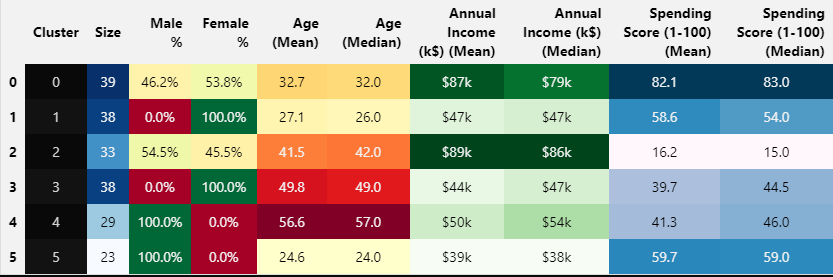

The 4D hierarchical clustering provides detailed segmentation, revealing gender-specific patterns in spending behavior across different age groups and income levels, much like the K-means analysis. The clusters identified are similar to those in the K-means analysis, with slight variations in the exact composition of each group.

# Comprehensive Comparison of K-means and Hierarchical Clustering Results

This analysis compares the results of K-means and Hierarchical clustering methods applied to mall customer data, focusing on their similarities, differences, and implications for marketing strategies.

## Cluster Composition and Characteristics

### K-means Clustering:

0. Middle-Aged to Older Female Moderate Spenders (41 customers)
   - 100% female, mean age 50.6, median income $50k, mean spending score 40.1
1. Young to Middle-Aged Male High Spenders (38 customers)
   - 100% male, mean age 28.1, median income $62k, mean spending score 71.3
2. Young to Middle-Aged Female Trend-Setters (34 customers)
   - 100% female, mean age 26.0, median income $40k, mean spending score 59.5
3. Middle-Aged to Older Male Conservative Spenders (35 customers)
   - 100% male, mean age 55.6, median income $54k, mean spending score 36.2
4. Affluent Middle-Aged Female Shoppers (23 customers)
   - 91.3% female, mean age 32.1, median income $81k, mean spending score 81.4
5. Affluent Middle-Aged Conservative Spenders (29 customers)
   - 55.2% female, mean age 36.5, median income $86k, mean spending score 18.0

### Hierarchical Clustering:

0. Mixed Gender Young to Middle-Aged High Spenders (39 customers)
   - 53.8% female, mean age 32.7, median income $79k, mean spending score 82.1
1. Exclusively Female Young Medium-High Spenders (38 customers)
   - 100% female, mean age 27.1, median income $47k, mean spending score 58.6
2. Mixed Gender Middle-Aged High Earners, Low Spenders (33 customers)
   - 45.5% female, mean age 41.5, median income $86k, mean spending score 16.2
3. Exclusively Female Older Moderate Spenders (38 customers)
   - 100% female, mean age 49.8, median income $47k, mean spending score 39.7
4. Exclusively Male Older Moderate Earners, Moderate Spenders (29 customers)
   - 100% male, mean age 56.6, median income $54k, mean spending score 41.3
5. Exclusively Male Very Young Low Earners, Medium-High Spenders (23 customers)
   - 100% male, mean age 24.6, median income $38k, mean spending score 59.7

## Key Differences in Clustering Results

1. Gender Distribution:
   - K-means: More gender-specific clusters (4 single-gender, 2 mixed but one is female dominated)
   - Hierarchical: More balanced (4 single-gender, 2 mixed with aprox. 50/50 ratio)

2. Age Segmentation:
   - K-means: Broader age ranges within clusters
   - Hierarchical: More distinct age segmentation, especially for younger and older groups

3. High-Value Customers:
   - K-means: Clearly identifies affluent, high-spending female group (Cluster 4)
   - Hierarchical: Combines high-income, high-spending customers across genders (Cluster 0)

## Implications for Marketing Strategies

1. Target Audience Identification:
   - K-means: Offers more gender-specific targeting opportunities
   - Hierarchical: Provides insights into mixed-gender groups with similar behaviors

2. Age-Based Marketing:
   - K-means: Suitable for broader, life-stage based campaigns
   - Hierarchical: Allows for more precise age-targeted marketing, especially for younger and older segments

3. Luxury Market Approach:
   - K-means: Clear focus on affluent female shoppers
   - Hierarchical: Suggests a more gender-neutral approach to luxury marketing

## Strengths and Limitations

### K-means Clustering:
- Strengths:
  - Clear gender-based segmentation
  - Easily identifiable high-value customer segment
  - Distinct income-spending relationships
- Limitations:
  - Less nuanced age segmentation
  - May oversimplify some mixed-gender behaviors

### Hierarchical Clustering:
- Strengths:
  - More precise age segmentation
  - Captures nuanced spending behaviors across genders
  - Uniform cluster sizes for balanced analysis
- Limitations:
  - Less clear-cut high-value segment
  - More complex relationships between variables within clusters

## Conclusion

Both clustering methods offer valuable insights for customer segmentation and targeted marketing strategies. K-means clustering provides clearer gender-based distinctions and easily identifiable high-value segments, making it suitable for broad, gender-specific marketing campaigns. Hierarchical clustering offers more nuanced insights into age-related spending behaviors and mixed-gender groups, allowing for more precise targeting based on age and lifestyle factors.

For a comprehensive marketing strategy, consider:
1. Using K-means results for gender-specific campaigns and identifying primary high-value targets.
2. Leveraging hierarchical clustering insights for age-specific marketing and understanding nuanced spending behaviors across genders.
3. Combining insights from both methods to create a multi-faceted approach that addresses both broad demographic trends and specific behavioral patterns.

By utilizing the strengths of both clustering approaches, marketers can develop a more robust and targeted customer segmentation strategy, leading to more effective and personalized marketing campaigns.

## References
Machine Learning A-Z: AI, Python & R [2024]
Created by Hadelin de Ponteves, Kirill Eremenko, SuperDataScience Team and the Ligency Team
https://www.udemy.com/course/machinelearning/

